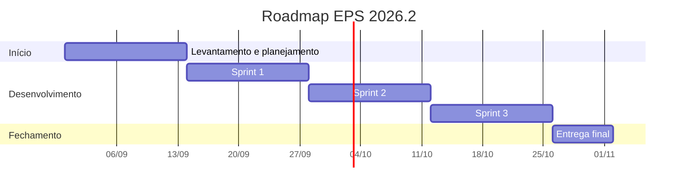

# Roadmap do semestre

## Linha do tempo

> Ajuste as datas conforme o calendário da disciplina.

## Marcos

| Marco | Data prevista | Entrega associada |
| --- | --- | --- |
| Release 1 | | |
| Release 2 | | |
| Entrega final | | |
