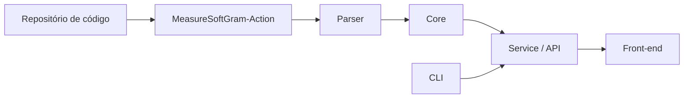

# Arquitetura

## Visão geral

> Descreva em alto nível como os componentes se relacionam. O diagrama abaixo é
> um ponto de partida - ajuste conforme a arquitetura real do sistema.

## Componentes

| Componente | Responsabilidade | Tecnologia |
| --- | --- | --- |
| Core | Cálculo do modelo de qualidade | Python |
| Parser | Normalização de métricas de entrada | Python |
| Service | API e persistência | Python / Django |
| Front | Interface web | TypeScript / React |
| CLI | Interface de linha de comando | Python |
| Action | Integração com GitHub Actions | - |

## Decisões arquiteturais

> Registre aqui as decisões tomadas pela equipe, com contexto e alternativas
> consideradas. Uma entrada por decisão.

### ADR 001 - Título da decisão

- **Contexto:**
- **Decisão:**
- **Alternativas consideradas:**
- **Consequências:**
